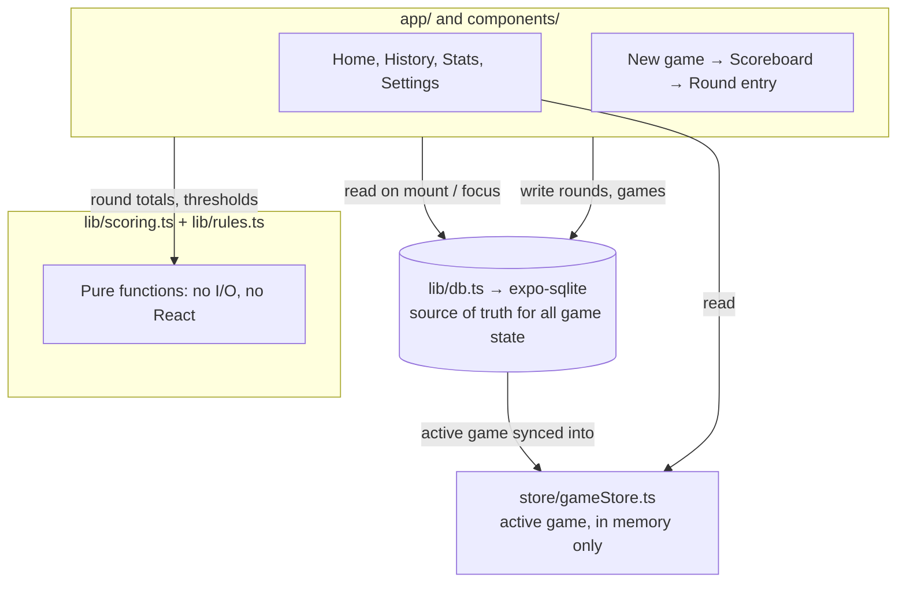

# Architecture

Rami Score is a mobile scorekeeping app for Moroccan Rummy (Rami Marocain). It does not play cards for you or enforce table rules during a hand; it replaces the paper notepad people use at the table to track who's winning across the three local variants: Simple, 71 (Tallage), and 71 Bla Joker. Everything runs offline on the phone. There is no account and no server.

For game rules and open rule questions, see [RULES.md](RULES.md). For visual direction, see [DESIGN.md](DESIGN.md). For build and deploy steps, see [SETUP.md](SETUP.md). For build status and what's planned next, see [PROGRESS.md](PROGRESS.md). This document only covers how the code is organized and how it works today.

## How it's organized

```
app/                  Screens (expo-router, file-based routing)
  (tabs)/              Home, History, Stats, Settings
  game/                New game, active scoreboard, round entry
components/           Reusable UI: Scoreboard, ScoreInput, VariantPicker, PlayerCard
lib/                   Framework-free logic
  db.ts                 SQLite schema, queries, migrations
  scoring.ts             Round and game math (pure functions)
  rules.ts                Variant definitions, thresholds, card values
  i18n.ts                  Darija, French, English strings
store/                Zustand store, mirrors the active game in memory
constants/             Shared color tokens
```

Two conventions worth knowing before touching the code:

- Components are PascalCase, everything in `lib/` is camelCase.
- Moroccan terms stay in the code as-is: `tirsi`, `suivi`, `vierge`, `tallage`, `blaJoker`. They aren't translated to "set," "run," or "clean" even in variable names.

## Data flow



SQLite is the only persistent store and the only source of truth. The Zustand store is a read cache for whichever game is currently active, refreshed from SQLite on app launch and after every write; it holds no logic of its own. `lib/scoring.ts` and `lib/rules.ts` are plain TypeScript with no React or SQLite imports, so the scoring math can be unit tested without rendering a screen.

One thing the diagram doesn't show: the app records *inputs* (who posed, who won, how many points were left in hand) rather than the cards themselves. It trusts the players to count their own hands correctly. There's no card-level state anywhere in the schema.

## Game-rule scope

The app doesn't check the 71-point lay-down threshold, the vierge requirement, or the raise mechanic. It's a scorekeeper, not a referee, by design: it trusts the input the players give it. Game-rule ambiguities (joker penalty value, Bla Joker edge cases, team formation, pioche exhaustion, and so on) are tracked in RULES.md under "Rules Still to Confirm," since they need a ruling from actual table play, not a code change.
