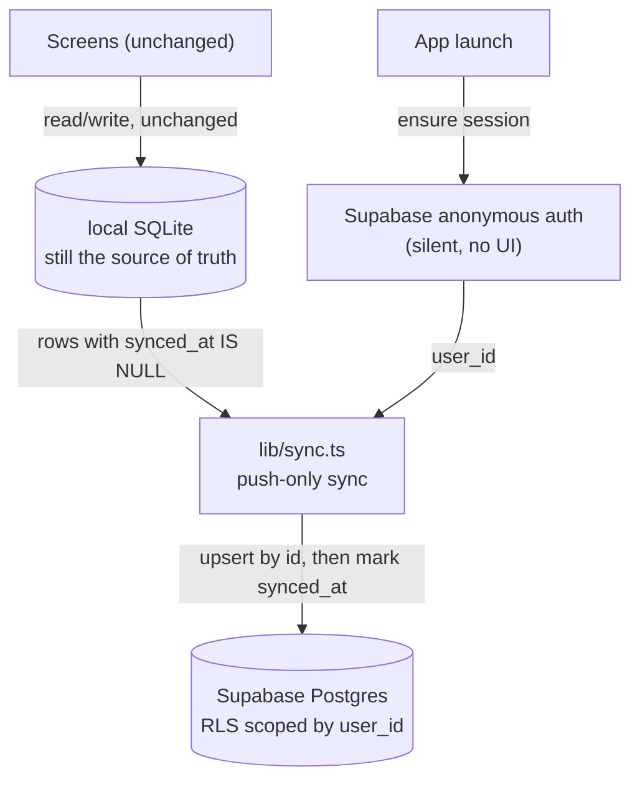

# Supabase backup sync: design

Date: 2026-06-30
Status: approved, not yet implemented

## Problem

Today all game data lives only in local SQLite (`lib/db.ts`). If the phone is lost, the app is deleted, or the device is replaced, every game and player record is gone with no way to recover it. PROGRESS.md lists "connect to a real database" as a planned initiative; this spec covers the first slice of that work.

## Goal (this slice)

Back up every local write to Supabase in the background, with zero impact on how the app behaves offline. Nothing about the existing screens, the existing SQLite schema's purpose, or the offline-first principle in CLAUDE.md changes. SQLite stays the source of truth for everything the UI reads and writes; Supabase becomes a mirror that's eventually consistent once the device has a network connection.

## Non-goals (this slice)

- **No pull/restore.** A fresh install does not recover a previous installation's history. That needs two-way sync and is a separate future task.
- **No multi-device live view.** A game started on one phone is not visible on another.
- **No conflict resolution.** Not needed because nothing ever reads from Supabase in this slice; SQLite is the only writer of record locally and the only source the UI ever reads from.
- **No sign-in screen, no email, no Sign in with Apple.** Apple Sign-In requires Apple Developer Program configuration (Services ID, capability, key) and a real auth UI; both are out of scope. Identity is handled by Supabase anonymous auth instead (see below).
- **No recovery code / account linking.** An anonymous identity that's lost (app deleted) cannot be reclaimed in this slice. Accepted limitation, not solved here.
- **No network-state listener or retry backoff.** A failed push is retried opportunistically on the next write or app launch. No new dependency for connectivity detection.

## Architecture



Every existing screen and every existing function in `lib/db.ts` keeps working exactly as it does today. Sync is an added side effect, never a dependency of reading or writing game state.

## Identity: Supabase anonymous auth

On app launch, before anything else touches Supabase, the app ensures an anonymous session exists:

```ts
// lib/sync.ts
async function ensureSession(): Promise<string> {
  const { data: { session } } = await supabase.auth.getSession();
  if (session) return session.user.id;
  const { data, error } = await supabase.auth.signInAnonymously();
  if (error) throw error;
  return data.user!.id;
}
```

The Supabase JS SDK persists the session via AsyncStorage, so the same anonymous `user_id` survives app restarts on the same install. There's no UI, no prompt, nothing the user sees or interacts with. This `user_id` is attached to every row pushed to Supabase and is what Row Level Security policies check.

## Local schema change

One new nullable column on every table that needs to be backed up: `synced_at INTEGER`. `NULL` means "not yet pushed (or changed since last push)." This is additive, so it's schema version 2 in `lib/db.ts`'s existing migration pattern:

```sql
-- schema_version 2
ALTER TABLE players ADD COLUMN synced_at INTEGER;
ALTER TABLE games ADD COLUMN synced_at INTEGER;
ALTER TABLE game_players ADD COLUMN synced_at INTEGER;
ALTER TABLE rounds ADD COLUMN synced_at INTEGER;
ALTER TABLE round_scores ADD COLUMN synced_at INTEGER;
```

Every `db.ts` function that inserts or updates one of these rows must leave (or reset) `synced_at` to `NULL` for that row, since `NULL` is what marks it as pending:

- `createPlayer`: new row, `synced_at` starts `NULL`. (Already true since it's not set on insert.)
- `createGame`: new `games` row and new `game_players` rows, both `NULL`.
- `addRound`: new `rounds` row and new `round_scores` rows, both `NULL`.
- `completeGame` / `abandonGame`: these `UPDATE games SET status = ...`. Add `, synced_at = NULL` to both so the status change gets re-pushed even though the row already synced once before.

## Supabase schema

Run once in the Supabase SQL editor when the project is created. Mirrors the local schema, adds `user_id` for RLS, and reuses the same client-generated text IDs SQLite already produces (no ID remapping in either direction).

```sql
create table players (
  id text primary key,
  user_id uuid not null references auth.users(id),
  name text not null,
  avatar text,
  created_at bigint not null
);

create table games (
  id text primary key,
  user_id uuid not null references auth.users(id),
  status text not null,
  variant text not null,
  score_threshold integer not null,
  is_team_mode boolean not null,
  custom_rules text,
  created_at bigint not null,
  completed_at bigint,
  winner_id text
);

create table game_players (
  game_id text not null,
  player_id text not null,
  user_id uuid not null references auth.users(id),
  seat_order integer not null,
  team integer,
  is_eliminated boolean not null,
  primary key (game_id, player_id)
);

create table rounds (
  id text primary key,
  user_id uuid not null references auth.users(id),
  game_id text not null,
  round_number integer not null,
  winner_id text,
  joker_color text,
  created_at bigint not null
);

create table round_scores (
  round_id text not null,
  player_id text not null,
  user_id uuid not null references auth.users(id),
  score integer not null,
  has_posed boolean not null,
  primary key (round_id, player_id)
);

alter table players enable row level security;
alter table games enable row level security;
alter table game_players enable row level security;
alter table rounds enable row level security;
alter table round_scores enable row level security;

create policy "owner full access" on players for all using (auth.uid() = user_id) with check (auth.uid() = user_id);
create policy "owner full access" on games for all using (auth.uid() = user_id) with check (auth.uid() = user_id);
create policy "owner full access" on game_players for all using (auth.uid() = user_id) with check (auth.uid() = user_id);
create policy "owner full access" on rounds for all using (auth.uid() = user_id) with check (auth.uid() = user_id);
create policy "owner full access" on round_scores for all using (auth.uid() = user_id) with check (auth.uid() = user_id);
```

Booleans are stored as SQLite integers (0/1) locally; the sync code converts to real booleans on the way out (`is_team_mode === 1` etc.), matching the conversions `lib/db.ts` already does for its own row-mapping today.

## Sync engine (`lib/sync.ts`)

One exported function, `syncPending()`, called from two places:

1. After every write in `lib/db.ts` that can produce a `synced_at IS NULL` row (`createPlayer`, `createGame`, `addRound`, `completeGame`, `abandonGame`). Fire-and-forget: call it, don't await it in the UI's critical path, swallow errors.
2. Once on app launch, in `app/_layout.tsx`, after `initDB()` and after the existing active-game load. This is the catch-up pass for anything that failed while offline.

`syncPending()` itself:

1. `ensureSession()` to get `user_id`. If this throws (no network on first-ever launch, so no anonymous session yet), abort silently, nothing else can proceed without it anyway.
2. For each table in dependency order (`players`, `games`, `game_players`, `rounds`, `round_scores`): query local rows where `synced_at IS NULL`, map each row to its Supabase shape (snake_case already matches, just add `user_id`), `upsert` the batch via `supabase.from(table).upsert(rows)`. `players`, `games`, and `rounds` upsert on the default primary key (`id`); `game_players` and `round_scores` have composite primary keys, so their upserts need an explicit `onConflict: 'game_id,player_id'` and `onConflict: 'round_id,player_id'` respectively. On success, `UPDATE ... SET synced_at = ? WHERE id IN (...)` locally for that batch (composite-key tables use the matching `WHERE` clause on both columns).
3. Catch and log (`console.warn`) any failure per table; continue to the next table rather than aborting the whole pass, and leave that table's rows unsynced for the next attempt.

No queue table, no retry scheduler, no exponential backoff. The "queue" is just "whatever currently has `synced_at IS NULL`," which is naturally re-derived every time `syncPending()` runs.

## New files

- `lib/supabase.ts`: creates and exports the Supabase client, configured with AsyncStorage for session persistence and the URL polyfill required on React Native.
- `lib/sync.ts`: `ensureSession()` and `syncPending()` as described above.

## Changed files

- `lib/db.ts`: schema version 2 migration; call `syncPending()` (fire-and-forget) at the end of `createPlayer`, `createGame`, `addRound`, `completeGame`, `abandonGame`; add `synced_at = NULL` to the two `UPDATE` statements.
- `app/_layout.tsx`: call `syncPending()` once after init.
- `package.json`: new dependencies.
- `.gitignore`: ensure `.env*` is ignored (it already should be via the standard Expo gitignore, will confirm during implementation).

## New dependencies

- `@supabase/supabase-js`
- `@react-native-async-storage/async-storage`
- `react-native-url-polyfill`

## Environment variables

`EXPO_PUBLIC_SUPABASE_URL` and `EXPO_PUBLIC_SUPABASE_ANON_KEY`, read via `process.env` in `lib/supabase.ts` per Expo's standard `EXPO_PUBLIC_*` convention. Both are public-safe client keys (protected by RLS, not secrecy), but still env vars rather than hardcoded so they're not tied to a specific person's project in source control. Stored in a local `.env` file, not committed.

## Manual setup (not doable from the CLI agent)

1. Create a Supabase project.
2. In Authentication settings, enable anonymous sign-ins.
3. Run the SQL above (schema + RLS policies) in the SQL editor.
4. Copy the project URL and anon public key into a local `.env` file.

## Error handling

Every Supabase call in `lib/sync.ts` is wrapped in try/catch. Failures are logged with `console.warn` and otherwise swallowed: a sync failure must never surface as an error to the player or block any local read/write. The existing `Alert.alert('Error', ...)` patterns in the screens are for local SQLite failures only and are untouched by this work.

## Testing

The repository has no automated test runner configured today. Verification for this slice is manual: play through a game end to end (new game, a few rounds, completion), then confirm in the Supabase table editor that matching rows exist with the same IDs and a non-null `synced_at` locally. Also verify offline behavior: turn off network, play a round (should work exactly as before), turn network back on, relaunch the app, confirm the round backfills.

## Docs to update once implemented

- **ARCHITECTURE.md**: data-flow diagram gets a new node for Supabase and a short paragraph; "There is no account and no server" in the overview needs rewording since there's now a server-side mirror, even though there's still no user-facing account system.
- **PROGRESS.md**: move "real database / cloud sync" from "Now planned" to done (for this slice), and add a new "Now planned" entry for the deferred two-way sync / restore work.
- **CLAUDE.md**: the "No sign-up, no auth in MVP" line needs a note that a silent anonymous identity exists for backup purposes, since it's no longer literally true at the infrastructure level even though there's still no sign-up screen.

## Future work (explicitly deferred)

- Pull/restore on fresh install (likely keyed off a recovery code, since there's no email/Apple ID to re-link an anonymous identity to).
- Two-way sync and the conflict resolution it requires.
- Surfacing sync status in Settings (last synced time, pending count).
